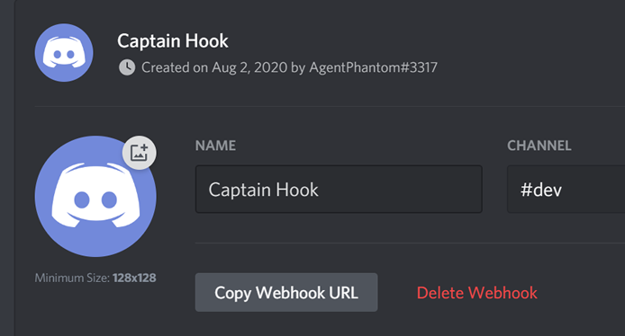
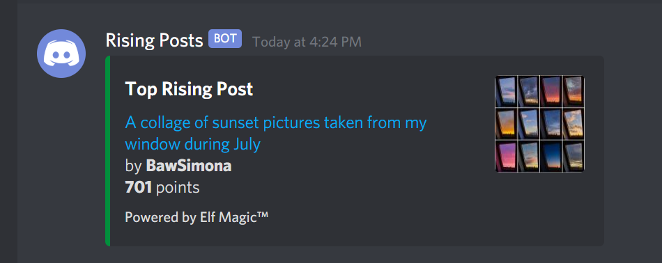
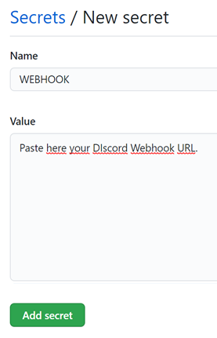

# Simple Bot on GitHub Actions

In this tutorial we will build a simple Discord webhook bot that posts the top rising submission of any given subreddit every 10 minutes.

This bot will be hosted on GitHub Actions which allows us to run arbitrary Python code for free. This approach is very similar to using a Linux VPS with crontab.

We will need very few things:

* A Discord server.
* One public GitHub repository.
* Python 3.6 or greater and `pip` on your local machine.

## Discord Webhook

Before anything else, we will require a Discord webbook, which is an url where we will send a `POST` HTTP request.

To do so we will require to own a Discord server, which is free.

I will assume you already have a Discord account and your server created.

Please follow these instructions to generate your webhook:

1. Open Discord on your web browser or desktop client.
2. Create a new channel or select an already existing one.
3. Click on the cog icon (settings).
4. On the left-side menu click on `Integrations`.
5. Then click on the `Webhooks` button.
6. Click on the `New Webhook` button.

You will see something very similar to the next image.



7. Click on the `Copy Webhook URL` button.
8. Paste the URL somewhere safe, we will use that in the next steps.

## Python Bot

This step is optional but recommended. We will test the webhook connection on our local machine before uploading it to GitHub.

This bot does 2 things, it first queries the Reddit API for the top rising submission on the subreddit you want, it then creates a Markdown message and sends it to the webhook using a `POST` request.

This bot requires Python 3.6 or greater and only has one external dependency which can be installed using the following command on your CMD or Terminal:

```
# Windows
pip install requests

# macOS / Linux
pip3 install requests
```

Let's take a look at `script_local.py`.

The first thing you will notice is the declaration of the webhook url variable.

```python
WEBHOOK_URL = "https://discord.com/api/webhooks/..."
```

You must replace this url with the one you copied earlier from the Discord webhook settings panel.

After that, we have 2 important functions.

```python
def get_rising_submissions(subreddit):

    url = f"https://www.reddit.com/r/{subreddit}/rising.json?limit=1"
    headers = {"User-Agent": "Reddit Rising Checker v1.0"}

    with requests.get(url, headers=headers) as response:

        data = response.json()["data"]["children"]

        # Iterate over all the children.
        for item in data:

            item_data = item["data"]

            # We will collect only the fields we are interested in.
            title = item_data["title"]
            permalink = "https://reddit.com" + item_data["permalink"]
            author = item_data["author"]
            score = item_data["score"]
            image_url = item_data["url"]

            # Compose a Markdown message using string formatting.
            message = f"[{title}]({permalink})\nby **{author}**\n**{score:,}** points"

            return (message, image_url)
```

This function requests the top rising submission from the specified subreddit. I have set r/pics as an example.

This function composes and returns a Markdown message that will then be used by the `post_message` function.

```python
def post_message(message, image_url):

    payload = {
        "username": "Rising Posts",
        "embeds": [
            {
                "title": "Top Rising Post",
                "color": 102204,
                "description": message,
                "thumbnail": {"url": image_url},
                "footer": {"text": "Powered by Elf Magic™"}
            }
        ]
    }

    with requests.post(WEBHOOK_URL, json=payload) as response:
        print(response.status_code)
```

This function creates a payload dictionary, adds customizations to our message and finally sends it to the webhook url.

If you run this script as-is you should receive a message on your server similar to the one on the next image.



At this point we have learned how to create a Discord webhook bot, but a bot must be automated and this is where GitHub Actions will be used.

## GitHub Actions

GitHub Actions is mostly used for CI tasks but fortunately enough it allows us to run any code we want and this bot is no exception.

Before continuing I will explain a few key points.

* GitHub Actions allows us to run 2,000 minutes of code for free each month.
* The repository behaves as a folder, for example this same README.md file is located at `./README.md`. Keep this in mind when you want to reference files in the same folder.
* We will be using Ubuntu, so any Linux commands work the same.
* The crontab on GitHub Actions is not precise, so don't rely on it for scripts that demand scheduled precision.

It's time to configure our repository.

### Secrets

Exposing your Discord webhook url is a terrible idea, anyone can use it to flood your server with spam or worse.

Thankfully there's a way to store it securely and this is using the repository secrets.

We are going to add our webhook url to the secrets section.

1. Create or navigate to your repository in a web browser.
2. Click the `Settings` tab.
3. On the left-side menu click the `Secrets` option.
4. Click the `New secret` button.
4. Name the secret `WEBHOOK` and paste your webhook url on the value field

It should look similar as in the next image.



We are almost done, only 2 things left to do.

### GitHub Actions Workflow

We now need to upload 3 files to the repository. The first one is the `script_remote.py` file that is included in this same repository.

This script is almost the same as the local one, the only difference is that it reads the webhook url from an environment variable (the secret we just created) instead of it being hard-coded in the script.

This file must be uploaded in the top-level of the repository (`./script_remote.py`).

We also need to add a file named `requirements.txt` to the top-level of the repository. The contents of this file must be the word `requests`. This file is also included in this repository.

Afterwards we need to create a folder named `.github` and INSIDE that folder create another folder named `workflows`.

Inside that `workflows` folder you must add a `.yml` file. You can name it as you like but it must have that file extension.

The following code is the contents of the  `.yml` file we will be using.

```yml
name: Discord Webhook

# 'on' is the trigger, in this case this Action will
# be triggered using cron set at a 10 minutes interval.
on:
  schedule:
    - cron: "*/10 * * * *"

# 'jobs' are the routines, we only have
# one when the instance is built.
jobs:
  build:
    # Our instance will use the latest available version of Ubuntu.
    runs-on: ubuntu-latest

    # These steps are run in the same order as are defined.
    steps:
      # actions checkout and python are pre-built actions
      # that abstract commonly used tasks.
      - uses: actions/checkout@v2

      # The python action will set us a Python 3.8 (64-bit) instance.
      - name: Setting up Python
        uses: actions/setup-python@v2
        with:
          python-version: "3.8"
          architecture: "x64"

      # Use PIP to install the dependencies and then run the script.
      - name: Running Script
        # But first we read the WEBHOOK secret and create an
        # environment variable with the same name.
        env:
          WEBHOOK: ${{ secrets.WEBHOOK }}
        run: |
          pip install -r requirements.txt
          python script_remote.py

```

I added comments explaining what each line does. Most of the code can be reused for similar projects.

It is important to note how we read the `WEBHOOK` secret and set it as an environment variable so we can use it in our script without exposing it to the public.

Save this file to the `.github/workflows` folder as `bot.yml` and let's wait a bit until it automatically runs.

If everything went right you must receive a message in your Discord server as we did with the local file.

Debugging Actions is really easy.

1. On your repository click on the `Actions` tab.
2. You will see a list of workflow runs.
3. If the Discord Webhook workflow was successful you will see a small checkmark, otherwise you will see a cross.
4. Click on the latest workflow run.
5. On the left-side menu click on the `build` menu item.
6. On the right-side, a panel will show what happened on each step, we can see the output of each time we used the `print` function.

*Note: If your Action was never triggered, make sure you have the correct folder structure. I encourage you to clone this same repository and use it as a template.*

*The only change you need to make is to remove the underscore from the _workflows folder so they are enabled.*

## Conclusion

I hope you liked this tutorial and I hope it gives you ideas on how to expand on this idea.

For example, if you want to make a Reddit bot you would only require to set 4 secrets (username, passowrd, app id and app secret), add `praw` to the requirements.txt file and you are ready to go.

While writing this tutorial I also tried another script that generated .csv files and stored them into the same repository.

You can also use this workflow to generate daily reports from different sources.
